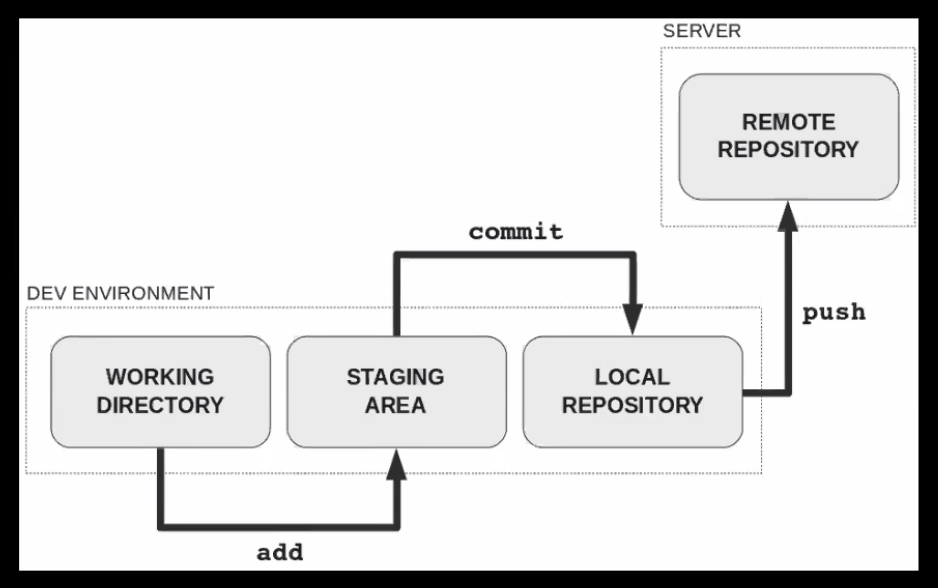
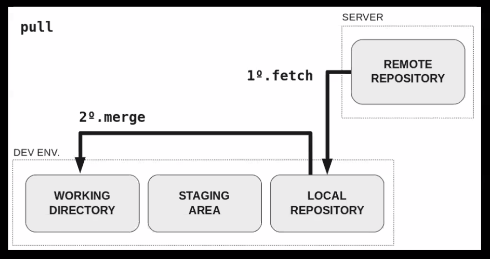
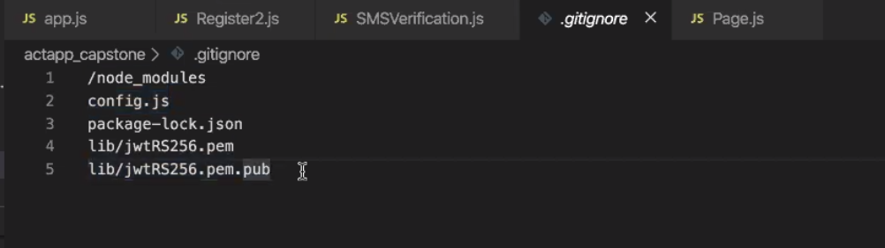

# GIT & GITHUB

## What is Git?
- when you download git onto your computer, three things are being downloaded onto your pc
    - working directory
    - staging area 
    - local repository

## What is github?
- git repository hosting service. 
- remote repository.

## Git Clone
- when  you clone something from github (remote repository) you are making two copies one goes into the local repository and working directory.
- to add files you add files from the working directory to the staging area and then when you commit you put it into the local repository and then when you push you push it into the remote repository. 



## Git Pull
- when you pull from the remote repository it pulls it to the local repository first and then merges it into the working directory. 


## Steps to make changes:
1. add (git add .)
2. commit (git commit -m "comments")
3. push (git push origin)

## Important notes
- Bad practice to initialize a parent folder. It is better to initialize or have repositories in the sub folders.

## How to delete a .git
- rm -rf .git
    - this is used to delete a .git file. 

## What is .gitignore
- it is a way to make sure a file is not going to be pushed to github or the remote repository. 

### To create:
```
- go into the folder
- create a .gitignore
- open the .gitignore in vscode
- edit the file to add files and folders that you wish to keep private.
```


## Two ways to git repository

### First method
```
1. open terminal
2. mkdir wherever you want.
3. cd into that folder and run git init
4. go to github, create a new repo
    - do not create a .md file
5. after you created your repo you will then be taken to another webpage by github.
6. copy and run the command in the terminal
    - git remote add origin ...
7. cope and run the command in the terminal
    - git push -u origin master

- It is important to note that we are doing this inside of the folder that we wish to initialize as a git repo. 
```

### Second method
```
1. go to github
2. create a repository 
3. copy the http link in the green code button
4. go to your terminal
5. go to the parent folder
6. git clone {paste that http link}
7. this will create a dir with the name of the repository

- NOTE: you should run the git clone command inside of the parent folder bc this will create a directory with the repository name.
```
## Git Profile
- make a new repository
- name the repository with your account/owner name
- git clone that repo 
- edit content
- git push

