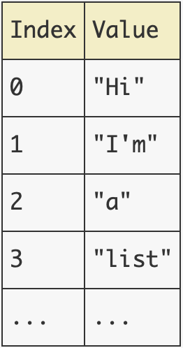
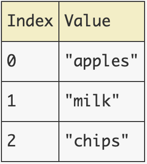
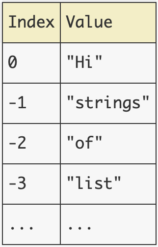
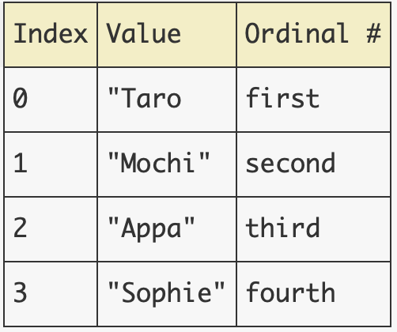

# Sequence

## What is it?
- a data type that can store multiple, individual values

```python
# Examples:

# List: 
numbers = [1, 2 , 3]

# Tuple:
gps_coordinates = (40.741895, -73.989308)

# Range:
numbers_from_zero_to_100: range(100)
```
___
## Lists
- lists are mutable - meaning they can be modified
- to create list you use brackets
```python
list_example = ["Hi", "I'm", "a", "list", "of", "strings"]
```
### How to access lists
- in the list {list_example}, here is how our values are stored.
- 

- Python uses an integer index to identify values.
- the first index is always 0

```python
list_example = ["Hi", "I'm", "a", "list", "of", "strings"]

print("The first item is:", list_example[0])
# Output:
# The first item is Hi. 
```

### Error Handling
- what happens if the user tries to access an index that doesn't exist within the list?
- the program error out and throw an IndexError

```python
groceries = ["apples", "milk", "chips"]
```
- in the groceries list there are 3 items
- therefore the index stops at 2, since lists begin with 0.
- 

```python
groceries = ["apples", "milk", "chips"]

print("What's the fourth thing I need to buy?", groceries[3])

# This will raise an IndexError
```
- you can try to error handle this by putting it in a try-except block

```python
try: 
    print("What's the fourth thing I need to buy?", groceries[3])
except IndexError:
    print("That item doesn't exist!")
```
### Negative Indexing
- you can pass negative numbers in the index to access the list.
- negative numbers will start from the end of the list. 
```python
list_example = ["Hi", "I'm", "a", "list", "of", "strings"]
```

```python
print("The last item in list_example is:", list_example[-1])
# Output
# The last item in list_example is: strings"
```

### List slicing
- slicing a list is when you want to grab a certain section of values from a list.
```python
list_example = ["Hi", "I'm", "a", "list", "of", "strings"]
print(list_example[1:3])
# Output
["I'm", "a"]
```
- the starting value is included but the ending value will not be included. 

### How to talk about it.
- it's important to note how to talk about what values is being access/desired.

```python
pets = ["Taro", "Mochi", "Appa", "Sophie"]
```


```python
# What's the name of your FIRST pet?
print(pets[0])

# What's the name of your THIRD pet?
print(pets[2])
```
